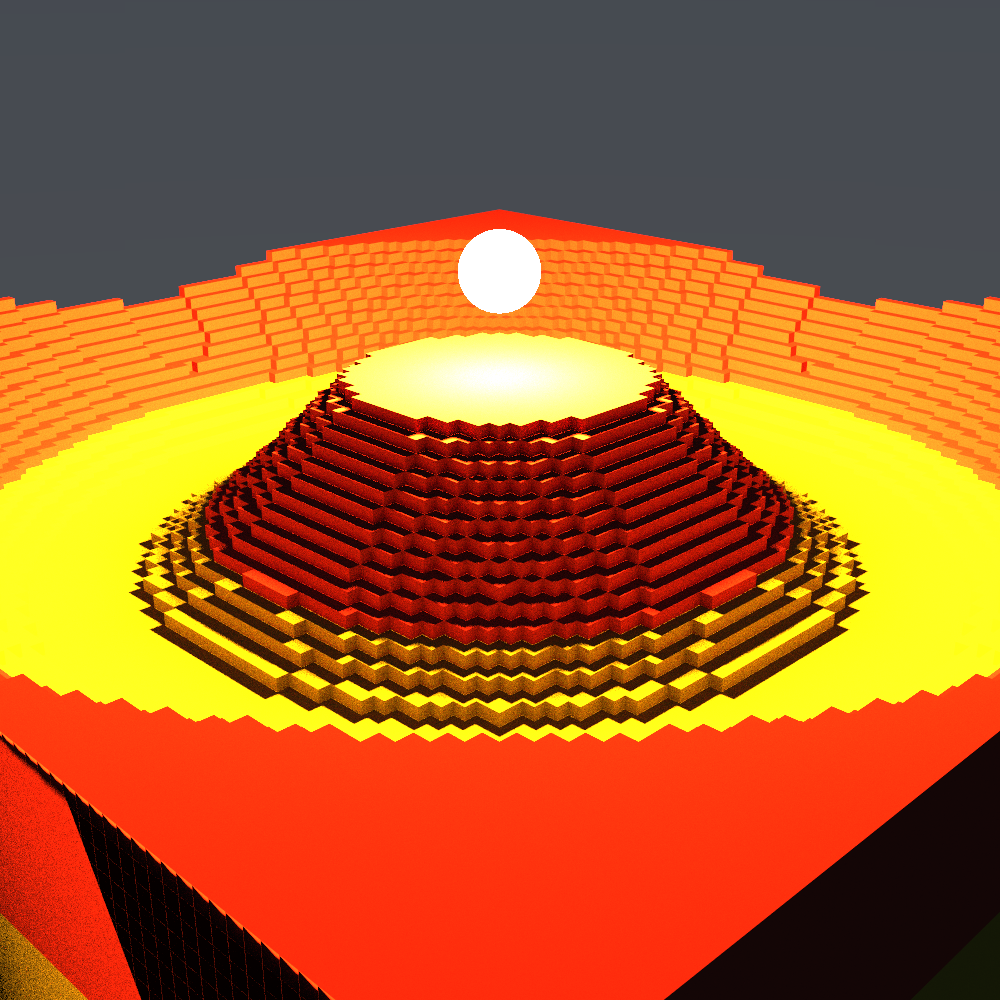
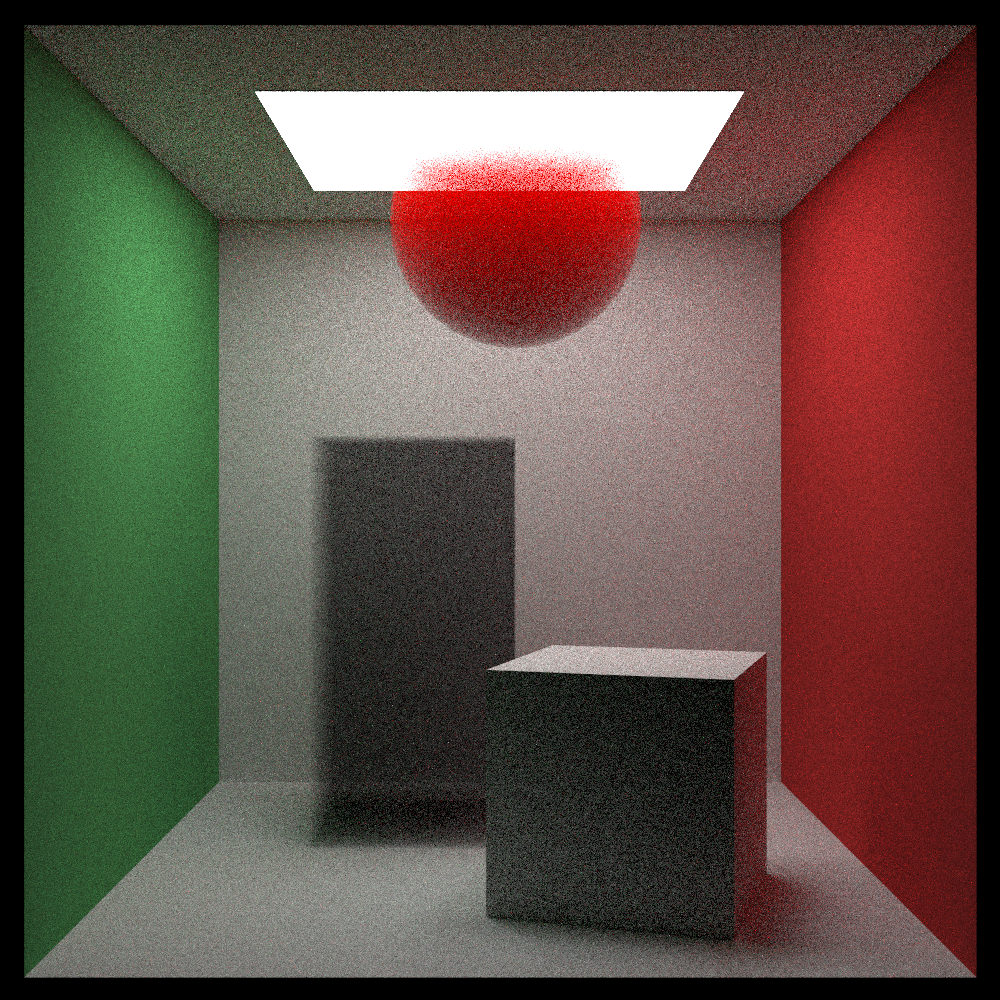
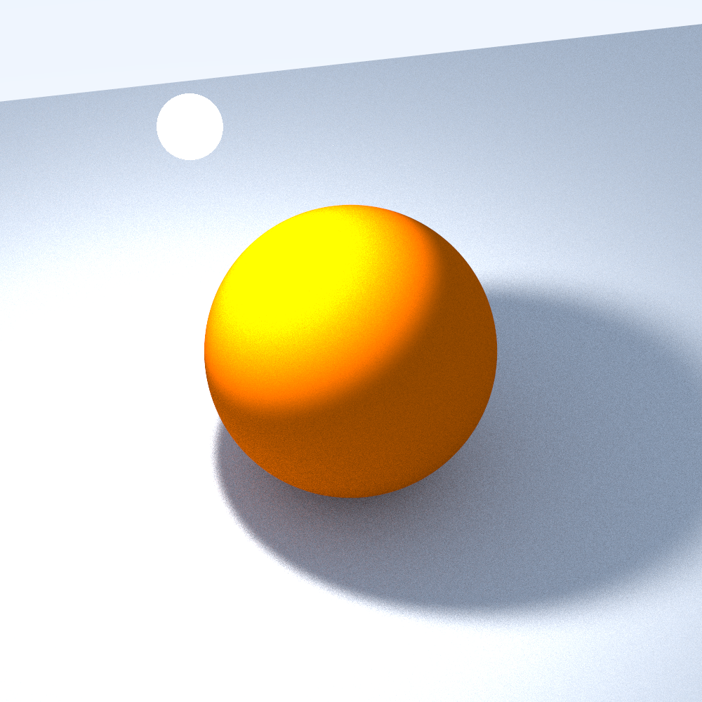
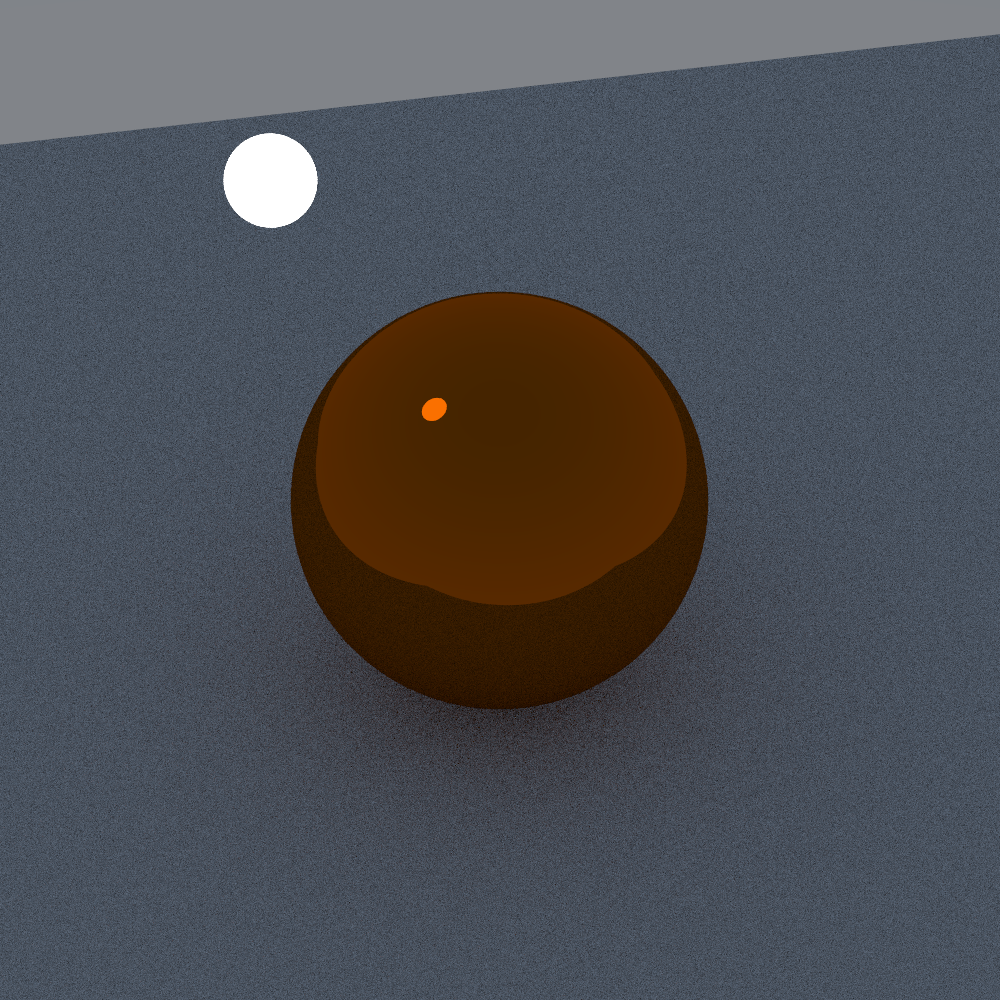
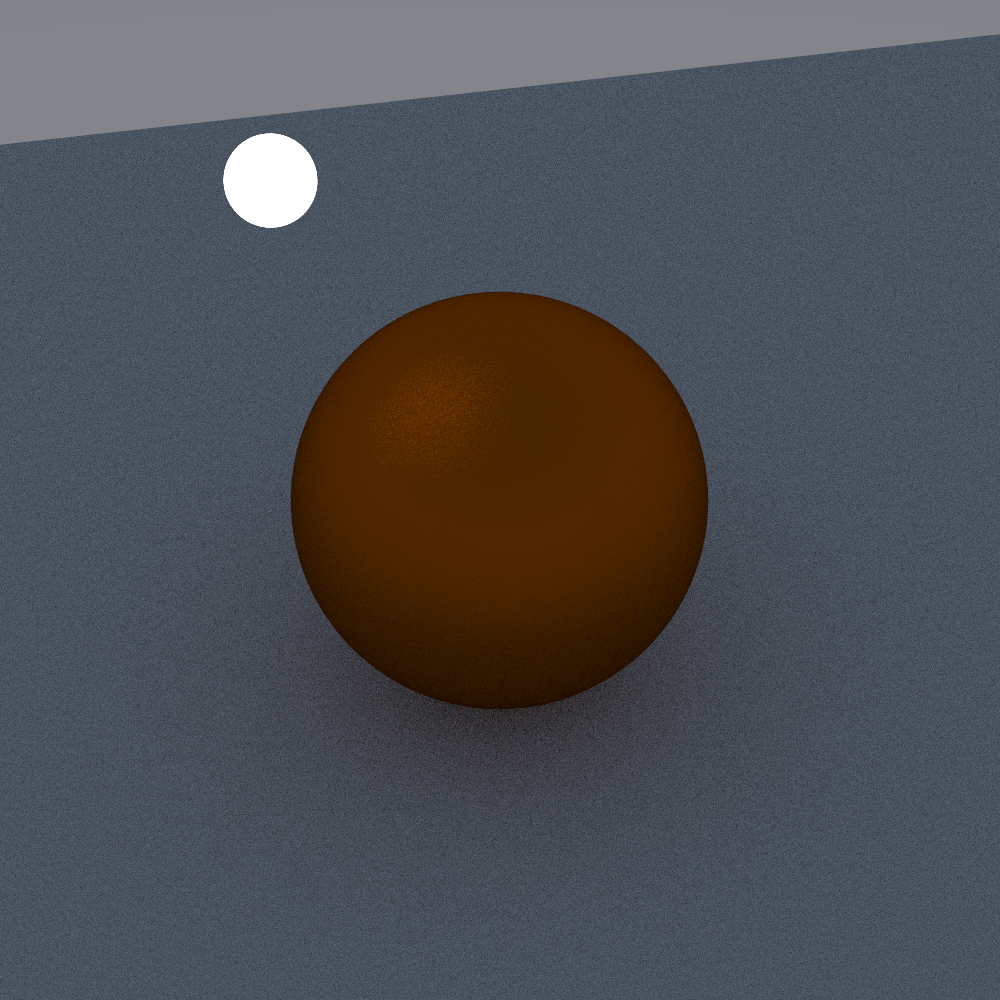
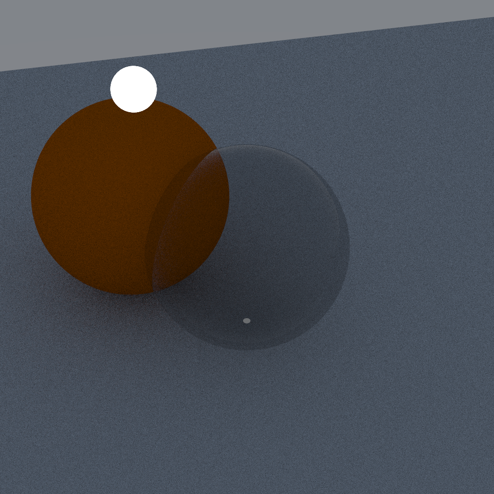
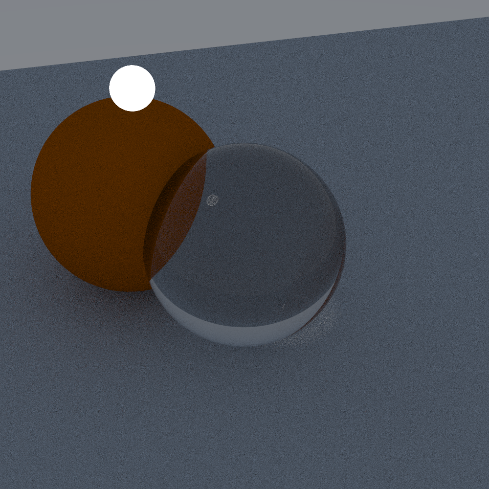
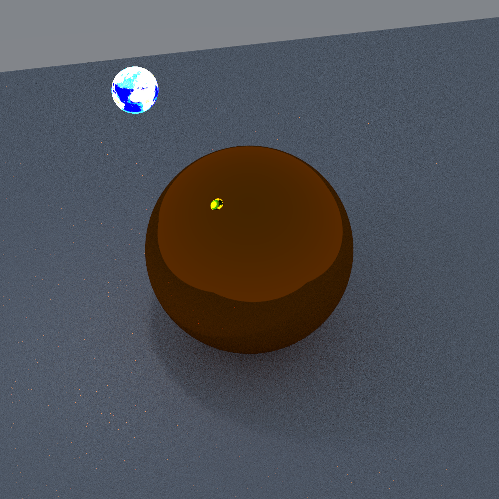
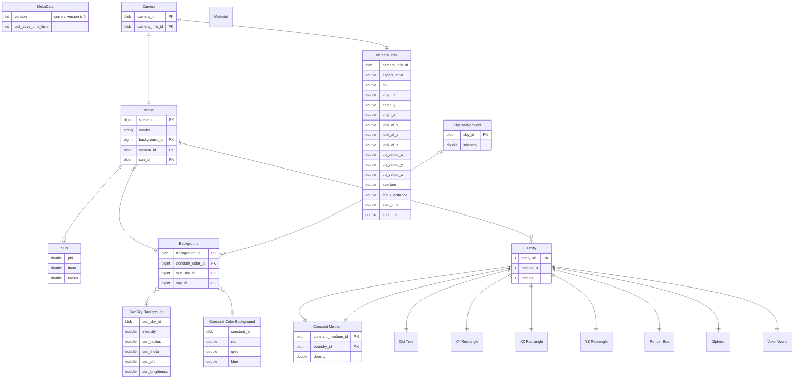
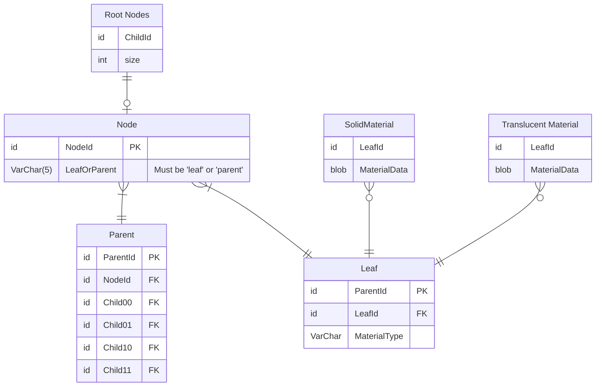

This is the Root repository for my raytracing project.
There are two ray tracers, a multithreaded cpu based raytracer and an in progress vulkan raytracer.

# Cpu Raytracer

The cpu raytracer initially used Raytracing in a Weekend book series by Peter Shirley (https://raytracing.github.io/) as
a guide.
It has however expanded far past the material taught in the book.

Supported Features

* Gui Editor
* Multithreading
* Post Processing Pipeline
* Many Materials

# Vulkan Raytracer

The vulkan raytracer is still in progress however it supports runtime configurable render pipelines.
It uses the vulkan raytracing extensions. It uses shaders writen in glsl and compiled to spir-v at build time.

# Minya Renderer and an inprogress vulkan based raytracer.

A CPU raytracer based off of the Raytracing in a Weekend book series by Peter Shirley (https://raytracing.github.io/)
and an in progress real time Vulkan rendering engine. It uses a bounding volume hierarchy inorder to accelerate ray
tracing.

## Cpu Renderer

The cpu raytracer is based off of the Raytracing in a Weekend series by Peter Shirley. It features multiple materials, a
GUI written with egui and support for loading arbitrary scenes. The supported materials are described below.

### Lambertian

A diffuse material that scatters light in random directions and absorbs a specific color based on the color of the
object. The following example render can be used by loading the "Lambertian Demonstration" scenario.

### Metal

Models a metallic surface. It reflects rays about the normal vector with a random blur based on a predifined "fuzz"
variable inorder to model metalic surfaces that are not completly polished.
An example of a smooth render is shown below.

When a surface is rough the rays are more likely to be reflected in a random direction and the same scene as above
is shown except with a fuzz of 0.6.

### Dielectric

A Dielectric Material simulates a transparent material with diffraction. A dielectric material can be used to simulate
glass. An example with low refraction shown below.

An example with high refraction is shown below. Notice how the orange sphere is distorted by the glassy sphere.

### DiffuseLight

A diffuse light source simply emits light. The light can emmit according to a texture. The texture can be proceedurally
generated noise, an image texture or a constant background.

An example of a diffuse light emmitting light according to a texture.

## Supported Shapes

Many different renderable shapes are supported

### Sphere

Spheres support

### Axis Aligned Box

### Axis Aligned Rectangles

### Voxel Grid

### Voxel Oct Tree

## Supported Transformations

### Translation

### Rotation

## Egui Gui

The gui was built inorder to make debuging and interacting with the renderer easier. It currently has a window for
selecting new scenes and a debug log window. The debug log window utilizes the [log](https://crates.io/crates/log) crate
inorder to provide a convient API that differentiates between debug, info, warnings and errors.

INSERT PICTURE HERE

## Vulkan Renderer

An in progress vulkan rendering engine is currently under construction. It is planned to use ray tracing. Currently it
supports loading some of the scenes from the cpu Minya renderer.

A rendering of the cornell box is shown below.

## Scene Schema

## Voxel Tree Schema

