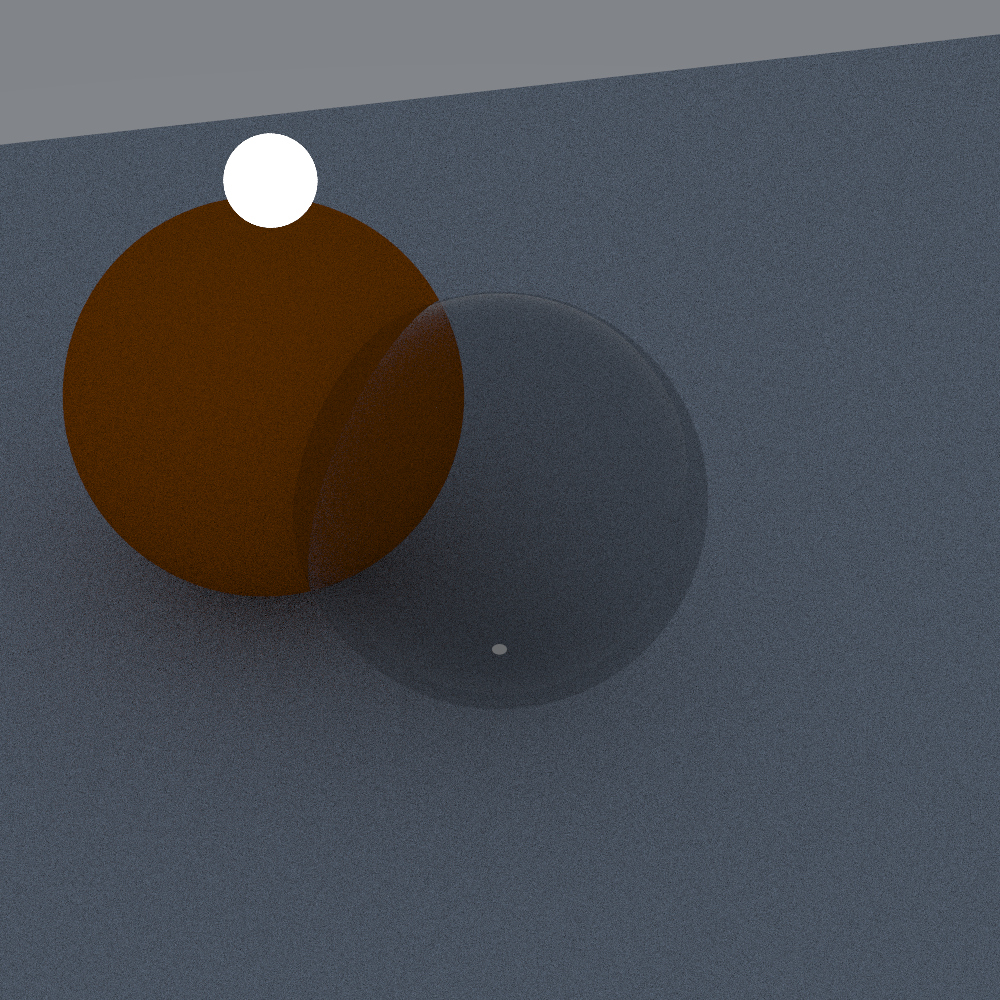
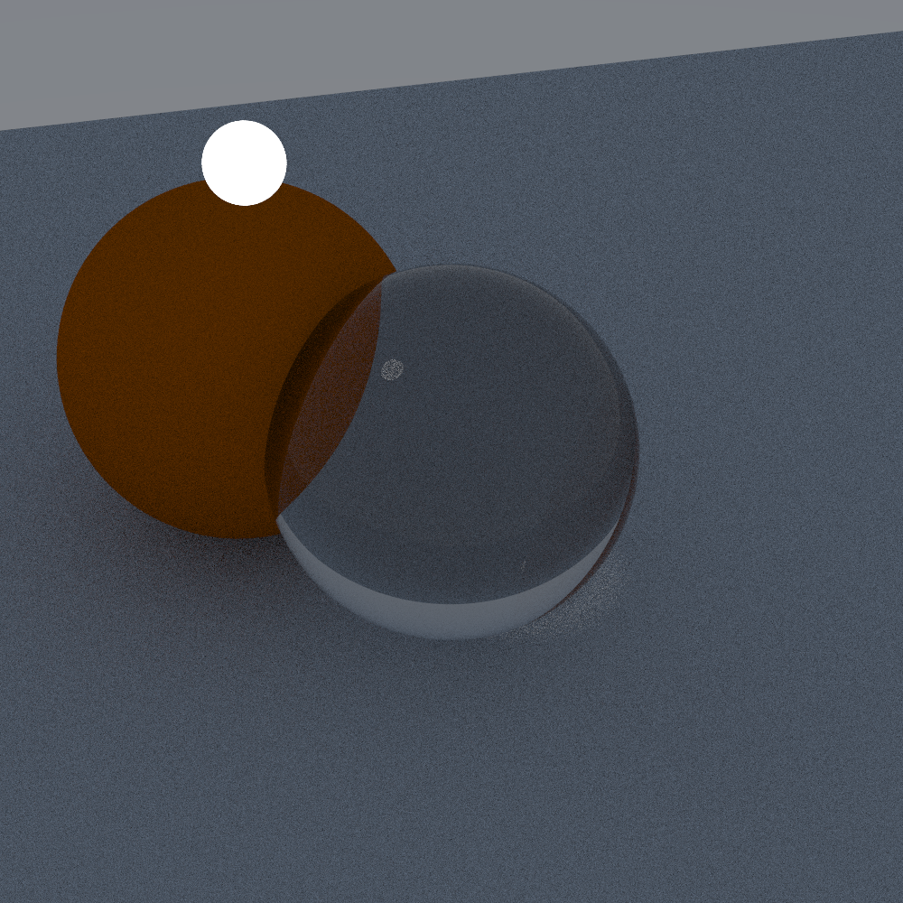
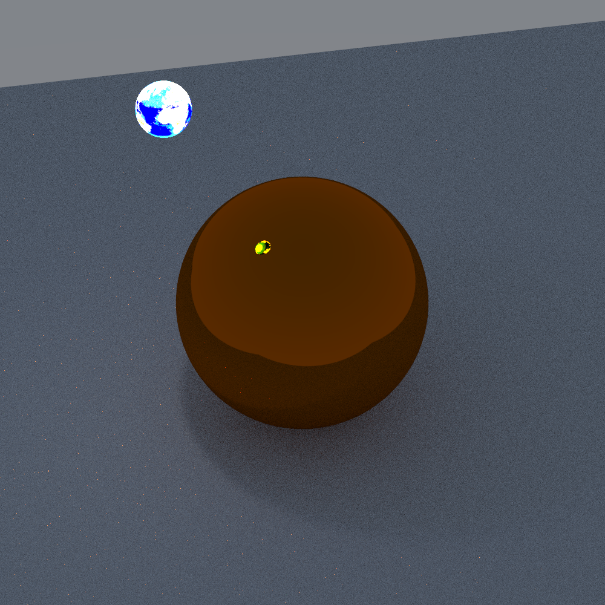
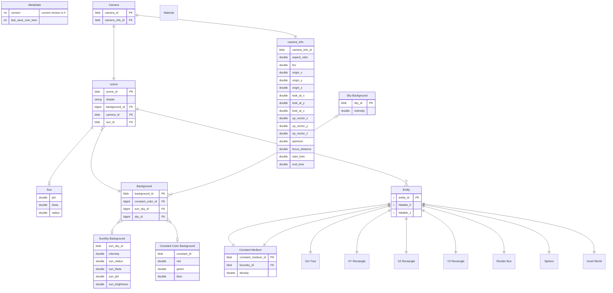
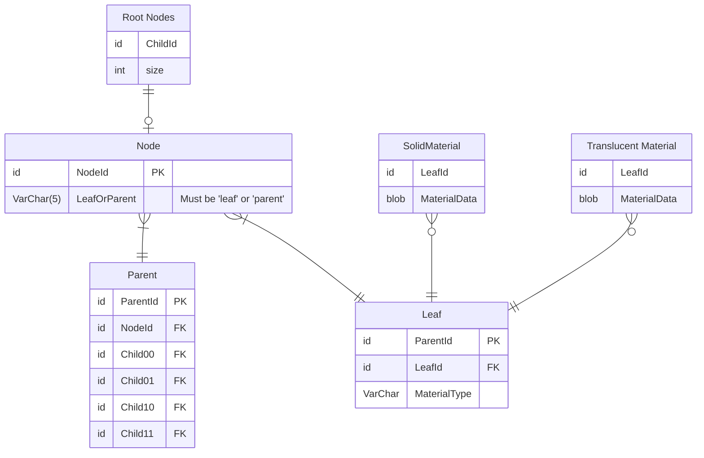

### Lambertian

A diffuse material that scatters light in random directions and absorbs a specific color based on the color of the
object. The following example render can be used by loading the "Lambertian Demonstration" scenario.

### Metal

Models a metallic surface. It reflects rays about the normal vector with a random blur based on a predifined "fuzz"
variable inorder to model metalic surfaces that are not completly polished.
An example of a smooth render is shown below.

When a surface is rough the rays are more likely to be reflected in a random direction and the same scene as above
is shown except with a fuzz of 0.6.

### Dielectric

A Dielectric Material simulates a transparent material with diffraction. A dielectric material can be used to simulate
glass. An example with low refraction shown below.

An example with high refraction is shown below. Notice how the orange sphere is distorted by the glassy sphere.

### DiffuseLight

A diffuse light source simply emits light. The light can emmit according to a texture. The texture can be proceedurally
generated noise, an image texture or a constant background.

An example of a diffuse light emmitting light according to a texture.

## Supported Shapes

Many different renderable shapes are supported

### Sphere

Spheres support

### Axis Aligned Box

### Axis Aligned Rectangles

### Voxel Grid

### Voxel Oct Tree

## Supported Transformations

### Translation

### Rotation

## Egui Gui

The gui was built inorder to make debuging and interacting with the renderer easier. It currently has a window for
selecting new scenes and a debug log window. The debug log window utilizes the [log](https://crates.io/crates/log) crate
inorder to provide a convient API that differentiates between debug, info, warnings and errors.

## Scene Storage Format

The renderer supports saving scenes to disk. The
scenes are stored in a sqlite3 database.
The schema is shown below.

## Voxel Tree Schema

